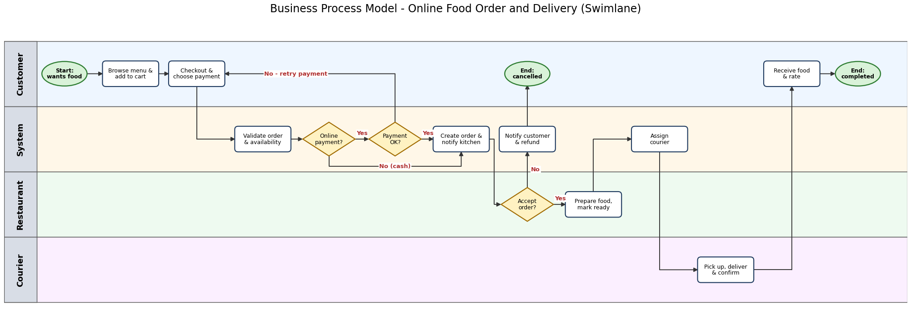
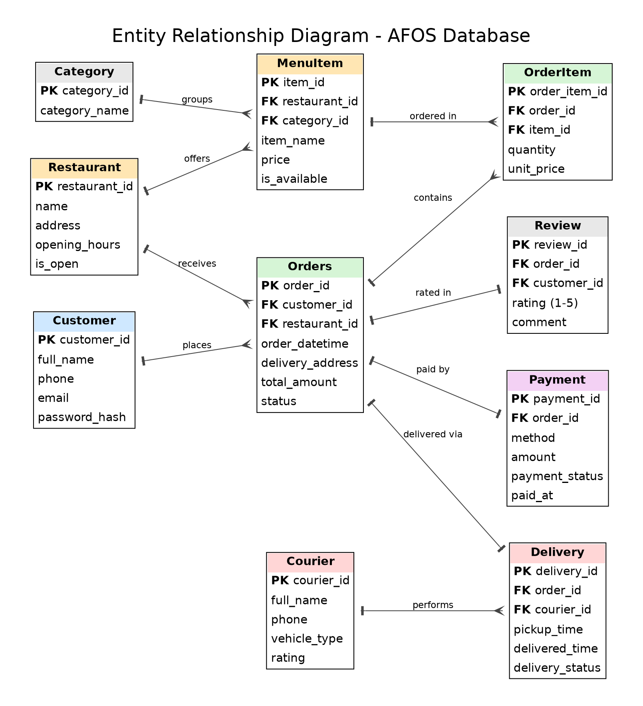
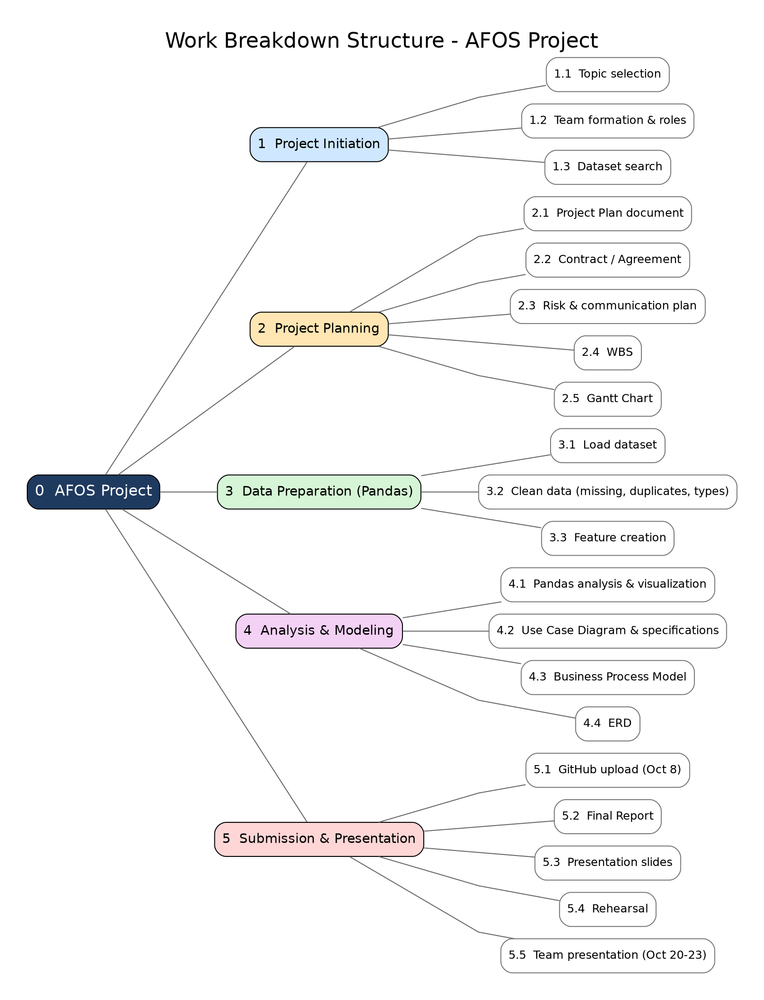

# IT PM Project 1: Project Plan

## 1. Course Information

* **Course Name:** IT Project Management
* **Instructor:** Prof. S. S. Kim

---

## 2. Team Information

* **Team Name:** `AJOU Team`

| Role | Name | Student ID | Group | Contact |
| :--- | :--- | :--- | :--- | :--- |
| **Team Leader** | Sobirov Muhammadullo | `202490310` | I24D | +998 95 175 95 60 |
| **Member 1** | Begjanov Artur | `202490087` | I24D | - |
| **Member 2** | Ahmadjonov Shohruz | `202490028` | I24D | - |

---

## 3. Project Overview

* **Project Title:** Food Order and Delivery System: Data Analysis of Delivery Time, Courier Performance, and Order Patterns
* **Summary:** An online food ordering and delivery platform connects customers, restaurants, and couriers. This project plans the **AJOU Food Order System (AFOS)** and uses **Pandas** to analyze real delivery records, showing how traffic, weather, courier workload, and time of day affect delivery time and where the service can be improved.

### Project Deliverables (modeling documents)

| Deliverable | File |
| :--- | :--- |
| Project Plan | `01_Project_Plan_1.md` (this document) |
| Contract / Agreement | [`Contract_Agreement.md`](Contract_Agreement.md) |
| Use Case Diagram | [`Use Case.png`](Use%20Case.png) |
| Business Process Model (BPM) | [`BPM.png`](BPM.png) |
| Entity Relationship Diagram (ERD) | [`ERD.png`](ERD.png) |
| Work Breakdown Structure (WBS) | [`WBS.png`](WBS.png) |
| Gantt Chart | [`Gantt Chart.png`](Gantt%20Chart.png) |

---

## 4. Dataset Specification

* **Dataset Title:** Food Delivery Dataset (Food Delivery Time Prediction)
* **Source / URL:** Originally published on Kaggle ("Food Delivery Dataset"); a copy is available at https://huggingface.co/datasets/aneesarom/Food-Delivery
* **Description:** One row per delivered order from an online food delivery platform. Columns cover the courier (ID, age, rating), restaurant and delivery coordinates, order date, order time and pickup time, weather, road traffic density, vehicle type and condition, type of order (Snack, Meal, Drinks, Buffet), number of simultaneous deliveries, festival flag, city type, and the total delivery time in minutes (`Time_taken(min)`).
* **Selection Justification:** It follows the full life of a food order (placement, pickup, delivery), which matches the order flow modeled in our BPM and ERD. It mixes numeric, categorical, date, and time columns and has real data-quality issues (missing values, text mixed into numbers), so it gives good practice for Pandas cleaning, grouping, and pivot tables.
* **Dimensions:** about 45,500 rows x 20 columns (the Kaggle `train.csv` has 45,593 rows; the Hugging Face copy has 45,584 after splitting). The exact size will be confirmed with `df.shape`.

---

## 5. Project Objectives

* **Core Problem Statement:** Food delivery platforms must deliver quickly to keep customers satisfied, but delivery time is affected by many factors (traffic, weather, courier workload, order type). Without analysis, the platform cannot plan courier allocation or give customers realistic delivery estimates.

* **Key Analytical Questions:**

1. What is the average delivery time overall and by city type?
2. How do road traffic density and weather conditions affect delivery time?
3. Which order types (Snack, Meal, Drinks, Buffet) are the most popular?
4. Do higher-rated couriers deliver faster?
5. Does the number of simultaneous deliveries increase delivery time?
6. At which hours and on which weekdays are orders the highest?
7. How do festivals affect delivery time and order volume?

* **Expected Insights & Deliverables:**
  * Heavy traffic and bad weather are expected to raise delivery time.
  * Lunch and evening hours are expected to be the peak order periods.
  * Couriers carrying several orders at once are expected to be slower.
  * Recommendations for courier allocation and delivery time estimates in AFOS.

---

## 6. Data Preparation (Pandas Pipeline)

* **Ingestion:** Loading `train.csv` into a Pandas DataFrame and inspecting shape, types, and missing values.
* **Cleaning Protocol:**
  * Strip whitespace from column names and text values; convert the text `"NaN"` to real missing values.
  * Convert age, rating, and `multiple_deliveries` to numeric; convert order dates to `datetime`.
  * Extract the number from the target column (`"(min) 24"` becomes `24`) and remove the `"conditions "` prefix from weather values.
  * Remove duplicates; fill numeric gaps with the median; drop rows with missing categorical values.
* **Feature Engineering:** `Weekday`, `Month`, `Order_Hour`, `Distance_km` (Haversine), `Speed_Category`.

```python
import pandas as pd
import numpy as np

# 1. Load
df = pd.read_csv("train.csv")
print(df.shape)
df.info()

# 2. Clean
df.columns = df.columns.str.strip()
df = df.rename(columns={"Weather_conditions": "Weatherconditions",
                        "Time_taken (min)": "Time_taken(min)"})   # in case the column names differ

for col in df.select_dtypes(include="object"):
    df[col] = df[col].str.strip()
df.replace("NaN", np.nan, inplace=True)

print("Duplicates:", df.duplicated().sum())
df.drop_duplicates(inplace=True)

for col in ["Delivery_person_Age", "Delivery_person_Ratings", "multiple_deliveries"]:
    df[col] = pd.to_numeric(df[col], errors="coerce")
df["Order_Date"] = pd.to_datetime(df["Order_Date"], format="%d-%m-%Y", errors="coerce")

df["Time_taken(min)"] = df["Time_taken(min)"].astype(str).str.extract(r"(\d+)")[0].astype(int)
df["Weatherconditions"] = df["Weatherconditions"].str.replace("conditions ", "", regex=False)

print(df.isna().sum())
df["Delivery_person_Age"] = df["Delivery_person_Age"].fillna(df["Delivery_person_Age"].median())
df["Delivery_person_Ratings"] = df["Delivery_person_Ratings"].fillna(df["Delivery_person_Ratings"].median())
df["multiple_deliveries"] = df["multiple_deliveries"].fillna(0)
df.dropna(subset=["City", "Road_traffic_density", "Festival", "Order_Date"], inplace=True)

# 3. Feature creation
df["Weekday"] = df["Order_Date"].dt.day_name()
df["Month"] = df["Order_Date"].dt.month
df["Order_Hour"] = pd.to_datetime(df["Time_Orderd"], format="%H:%M:%S", errors="coerce").dt.hour

def haversine(lat1, lon1, lat2, lon2):
    R = 6371
    p1, p2 = np.radians(lat1), np.radians(lat2)
    dlat, dlon = p2 - p1, np.radians(lon2 - lon1)
    a = np.sin(dlat / 2) ** 2 + np.cos(p1) * np.cos(p2) * np.sin(dlon / 2) ** 2
    return 2 * R * np.arcsin(np.sqrt(a))

df["Distance_km"] = haversine(df["Restaurant_latitude"], df["Restaurant_longitude"],
                              df["Delivery_location_latitude"], df["Delivery_location_longitude"])
df["Speed_Category"] = pd.cut(df["Time_taken(min)"], bins=[0, 20, 30, 100],
                              labels=["Fast", "Normal", "Slow"])
```

---

## 7. Data Analysis Tasks (Pandas)

```python
# Q1: Average delivery time overall and by city type
print(df["Time_taken(min)"].mean())
print(df.groupby("City")["Time_taken(min)"].mean().sort_values())

# Q2: Effect of traffic and weather
print(df.groupby("Road_traffic_density")["Time_taken(min)"].mean().sort_values())
print(df.groupby("Weatherconditions")["Time_taken(min)"].mean().sort_values())

# Q3: Most popular order types
print(df["Type_of_order"].value_counts())

# Q4: Courier rating vs delivery time
print(df[["Delivery_person_Ratings", "Time_taken(min)"]].corr())
print(df.groupby(pd.cut(df["Delivery_person_Ratings"], [0, 3, 4, 4.5, 5]), observed=True)["Time_taken(min)"].mean())

# Q5: Simultaneous deliveries
print(df.groupby("multiple_deliveries")["Time_taken(min)"].mean())

# Q6: Peak hours and weekdays
print(df["Order_Hour"].value_counts().sort_index())
print(df["Weekday"].value_counts())

# Q7: Festival effect
print(df.groupby("Festival")["Time_taken(min)"].agg(["count", "mean"]))

# Pivot table: traffic vs weather
pivot = pd.pivot_table(df, values="Time_taken(min)", index="Road_traffic_density",
                       columns="Weatherconditions", aggfunc="mean").round(1)
print(pivot)

# Filtering and sorting: slowest deliveries in heavy traffic
slow = df[(df["Road_traffic_density"] == "Jam") & (df["Time_taken(min)"] > 40)]
print(slow.sort_values("Time_taken(min)", ascending=False).head(10))
```

Visualizations (Matplotlib/Seaborn): bar charts of delivery time by traffic and weather, a line chart of orders by hour, a heatmap of the traffic x weather pivot table, and a scatter plot of courier rating vs delivery time.

---

## 8. Key Findings and Insights

*To be completed after the analysis is run (Week 3). Results below are placeholders.*

* Average delivery time: **[X] minutes**; slowest city type: **[type]**.
* Delivery time in "Jam" traffic is **[X]%** higher than in "Low" traffic.
* Weather with the longest delays: **[condition]**.
* Most popular order type: **[type]** (**[X]%** of orders).
* Courier rating vs delivery time correlation: **[r]**.
* Each extra simultaneous delivery adds about **[X] minutes**.
* Peak hours: **[hours]**; busiest weekday: **[day]**.

**Business interpretation:** AFOS should assign more couriers at peak hours and in heavy traffic or bad weather, limit simultaneous deliveries, and show realistic delivery estimates to customers.

---

## 9. Project Timeline

| Week | Activities |
| :--- | :--- |
| Week 1 (07 Sep ~ 13 Sep) | Topic selection, dataset search, and project planning |
| Week 2 (14 Sep ~ 20 Sep) | Data cleaning and preparation |
| Week 3 (21 Sep ~ 27 Sep) | Data analysis and visualization |
| Week 4 (28 Sep ~ 04 Oct) | WBS, Use Case Diagram, Contract, BPM and ERD drafting |
| Week 5 (05 Oct ~ 08 Oct) | Gantt Chart, final review, **GitHub upload (08 Oct)** |
| Week 6-7 (09 Oct ~ 19 Oct) | Report writing, presentation slides, rehearsal |

**Presentation:** 20, 22, or 23 Oct 2026 (in class)


---

## 10. Outcome of the Project

* **What we learn:** how to plan a team project (roles, schedule, WBS, risks), how to model a system (Use Cases, BPM, ERD), and how to turn raw delivery data into business insights.
* **Skills developed (Pandas):** loading CSV files, `info` / `describe` / `isna`, cleaning and type conversion, feature creation, filtering, sorting, `groupby`, `pivot_table`, `value_counts`, correlation, and basic visualization.

---

## 11. Conclusion

This project plans the AJOU Food Order System and analyzes a real food delivery dataset with Pandas to find what affects delivery time. Together with the Use Case, BPM, ERD, WBS, Gantt Chart, and team contract, it shows how a food ordering service can be planned, modeled, and improved with data.

---

## 12. References

* Dataset: Food Delivery Dataset (Kaggle); copy at https://huggingface.co/datasets/aneesarom/Food-Delivery
* Pandas documentation: https://pandas.pydata.org/docs/
* NumPy documentation: https://numpy.org/doc/
* Matplotlib documentation: https://matplotlib.org/stable/
* Seaborn documentation: https://seaborn.pydata.org/
* IT Project Management lecture materials, Prof. S. S. Kim

---

## 13. Appendix

### A. Use Case Diagram


### B. Business Process Model


### C. Entity Relationship Diagram


### D. Work Breakdown Structure


### E. Use Case Specification: UC-03 Place Order

| Field | Description |
| :--- | :--- |
| **Primary Actor** | Customer |
| **Secondary Actors** | Payment Gateway, Restaurant Staff |
| **Preconditions** | Customer is logged in; restaurant is open; items are available |
| **Postconditions** | Order is created with status "Placed" and the restaurant is notified |

**Main flow:** (1) Customer reviews the cart. (2) Customer confirms address and phone. (3) Customer chooses a payment method. (4) Customer confirms the order. (5) System validates the order. (6) System processes online payment (UC-04). (7) System creates the order and notifies the restaurant. (8) System shows confirmation and estimated delivery time.

**Alternative flow:** Cash on delivery skips step 6 and marks the order "Payment pending".

**Exceptions:** an item becomes unavailable (customer replaces it); the restaurant closes (checkout is cancelled); payment fails (customer retries or changes method).
